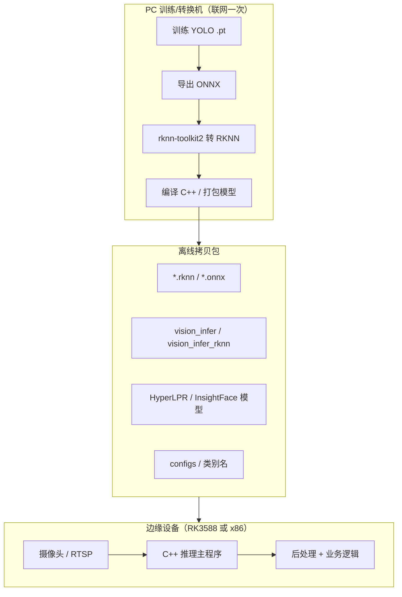

# 离线落地流程 & 方案 A（C++ + RKNN 量产）

本文描述从 **训练机（可联网）** 到 **边缘设备（完全离线）** 的完整流程。

## 总体流程



## 阶段一：PC 端准备（联网）

### 1. 拉齐源码与模型

```bash
python scripts/setup_third_party.py
python scripts/setup_yolo_sources.py
python scripts/setup_third_party.py --download-hyperlpr-models --download-face-model
python scripts/download_pretrained_weights.py
python scripts/check_offline_deps.py    # 全部 OK 再继续
```

### 2. 训练各任务

```bash
python -m src.train.trainer --task helmet --device 0 --epochs 50
python -m src.train.trainer --task plate --device 0 --epochs 50
python -m src.train.trainer --task action --device 0 --epochs 50
python -m src.train.trainer --task face --device 0
```

### 3. 导出部署格式

```bash
# ONNX（所有平台通用中间格式）
python scripts/export_models.py --task all --format onnx --yolo yolov8 --model-size n

# RKNN（仅 PC x86 + rknn-toolkit2，供 RK3588 NPU）
pip install rknn-toolkit2   # 仅转换机
python scripts/export_models.py --task all --format rknn --yolo yolov8 --model-size n
```

导出产物位置（Ultralytics 默认在权重同目录或 run 目录）：

- `weights/helmet/best_yolov8n.onnx`
- `weights/helmet/best_yolov8n_rknn_model/`（内含 `.rknn`）

### 4. 编译 C++ 推理程序

按目标硬件选择文档：

- RK3588 → [platforms/RK3588_UBUNTU22.md](platforms/RK3588_UBUNTU22.md)
- NVIDIA x86 → [platforms/NVIDIA_X86_UBUNTU22.md](platforms/NVIDIA_X86_UBUNTU22.md)

---

## 阶段二：打包离线拷贝清单

拷贝到 U 盘 / 内网，**无需 Python 环境**（C++ 方案）：

```
offline_bundle/
├── bin/
│   └── vision_infer_rknn          # 或 vision_infer (ORT)
├── models/
│   ├── helmet_yolov8n.rknn
│   ├── plate_yolov8n.rknn
│   ├── action_yolov8n.rknn
│   ├── hyperlpr3/                  # 车牌 OCR（可选）
│   └── insightface/buffalo_l/      # 人脸 ONNX（可选）
├── lib/                            # 板端 .so 依赖（若未系统安装）
│   ├── librknnrt.so
│   └── ...
└── configs/
    └── classes.yaml                # 各类别 id → 名称
```

Python 全栈调试包（可选，体积大）：

```
整个 yolo_all/ 项目 + third_party/models/ + weights/
+ aarch64 或 x86_64 的 pip wheel 离线包
```

---

## 方案 A：C++ + RKNN（RK3588 量产推荐）

### 架构

```
摄像头 → OpenCV 预处理 → RKNN(YOLO) → NMS/解码(CPU)
                              ↓
              车牌框 → HyperLPR C++ / ORT(OCR)
              人脸框 → ORT(InsightFace ONNX)
```

### 为什么选方案 A

| 对比项 | Python 全栈 | 方案 A C++ + RKNN |
|--------|-------------|-------------------|
| NPU 利用 | 难 | 是 |
| 依赖体积 | torch 等 GB 级 | 仅 runtime .so |
| 启动速度 | 慢 | 快 |
| 离线维护 | 复杂 | 仅二进制 + 模型 |

### PC 端（转换）

1. 训练 → 导出 ONNX → **rknn-toolkit2** INT8 量化（准备 50~100 张校准图）
2. 交叉编译或板端 natively 编译 `vision_infer_rknn`
3. 可选：编译 `third_party/HyperLPR/cpp` 得到 `libhyperlpr3.so`

### 板端（RK3588 Ubuntu 22.04）

1. 安装 runtime：`librknnrt`、OpenCV（或使用拷贝的 .so）
2. 运行：`./vision_infer_rknn --model helmet.rknn --source /dev/video0`
3. **不需要** torch、ultralytics、Python

详细库清单与编译命令 → [platforms/RK3588_UBUNTU22.md](platforms/RK3588_UBUNTU22.md)

---

## 方案 B：C++ + ONNX Runtime（x86 NVIDIA 服务器）

适合 **NVIDIA GPU + Intel CPU + Ubuntu 22.04** 工控机/服务器，同样推荐 C++ 而非 Python 服务。

- GPU：`VISION_BACKEND=ORT_CUDA`
- 仅 CPU：`VISION_BACKEND=ORT_CPU`

详见 [platforms/NVIDIA_X86_UBUNTU22.md](platforms/NVIDIA_X86_UBUNTU22.md)

---

## 方案 C：Python 原型（不推荐量产）

仅用于算法验证。需拷贝完整项目 + pip wheel，见 `scripts/check_offline_deps.py`。

---

## 常见问题

**Q: RKNN 转换必须在 x86 PC 上吗？**  
A: 是。`rknn-toolkit2` 仅支持 x86 Linux，转换后将 `.rknn` 拷到板端。

**Q: InsightFace 在 C++ 里怎么用？**  
A: 不需要 Python 包。直接使用 `third_party/models/insightface/models/buffalo_l/*.onnx` + ONNX Runtime。Python 侧源码在 `third_party/insightface/python-package` 仅供训练/录入 gallery。

**Q: export_models.py --format rknn 失败？**  
A: 需安装 `rknn-toolkit2>=2.3.2`，且 ONNX opset ≤ 19。可先 `--format onnx` 再用手动转换脚本。

**Q: deploy/cpp 里 RKNN 推理实现了吗？**  
A: CMake 与选项已就绪，`yolo_detector.cpp` 仍为 ONNX 骨架；RKNN 推理需对接 `rknn_model_zoo` 的 YOLOv8 demo 或自行实现 `yolo_detector_rknn.cpp`（CMake 中已留 TODO 注释）。
